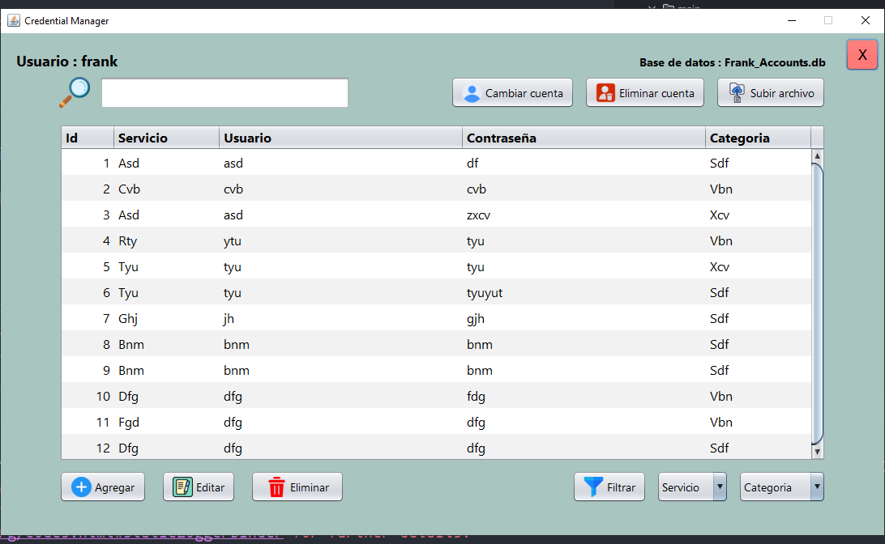

# Credential Manager

## Descripción

Aplicación de escritorio desarrollada con Java, Swing y SQLite, para gestionar contraseñas de forma segura. Permite a los usuarios almacenar, organizar y acceder a sus contraseñas utilizando una base de datos local con ubicación dinámica.

Descarga: [Credential Manager v1.0](https://github.com/FrankSkep/Credential-Manager/releases/tag/1.0)

### [Screenshots](screens/views.md)

## Características

- **Seguridad**: Registro y autenticación de usuarios para proteger el acceso a las contraseñas.
- **Cuentas de usuario**: Soporte para multiples cuentas de usuario en una misma base de datos, cada cuenta con sus propias contraseñas.
- **Gestión Segura de Contraseñas**: Almacenamiento seguro de contraseñas, utilizando encriptación y descifrado con una clave secreta.
- **Cambio y Creación de Base de Datos**: Opción para cambiar entre diferentes bases de datos o crear nuevas, en cualquier ubicacion que el usuario desee. (Se requiere autenticación del dueño de la base de datos a la que desea cambiar).
- **Búsqueda Rápida**: Funcionalidad de búsqueda en tiempo real para encontrar contraseñas con nombre del servicio, nombre de usuario o categoria.
- **Filtrado por Categorías y Servicios**: Posibilidad de clasificar contraseñas en categorías y servicios.
- **Patrón Singleton**: Implementación del patrón de diseño Singleton en la gestion de la conexión a la base de datos, el `PasswordDAO`, y el panel principal de la aplicación (`DashboardPNL`).
- **HikariCP**: Integración de HikariCP para la gestión eficiente de conexiones a la base de datos.

## Requisitos

- **Java Development Kit (JDK)**: 17 o superior.
- **Dependencias Externas**:
  - SQLite JDBC
  - HikariCP (Utilizada para el pool de conexiones a la base de datos)
  - Lombok (Utilizada para reducir codigo repetitivo mediante anotaciones)

## Licencia

**Este proyecto está licenciado bajo la [GNU Affero General Public License v3.0](https://www.gnu.org/licenses/agpl-3.0.html).**

© 2024 FrankSkep. Para más detalles, consulte el archivo completo [LICENSE](LICENSE).
